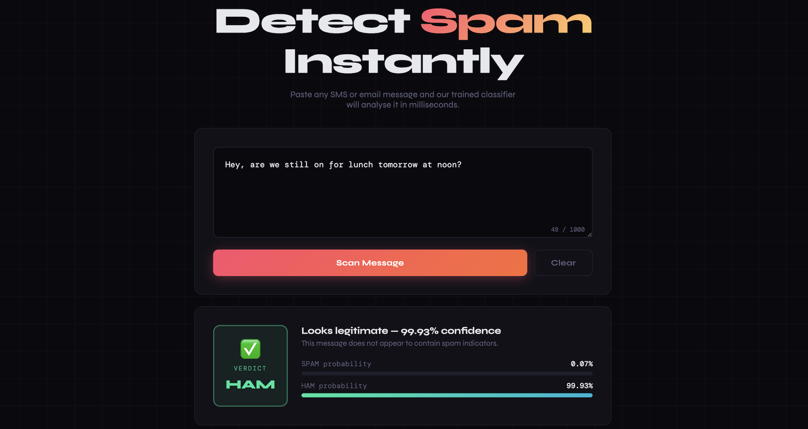

# 📱 Spam Message Detection

 
## 📌 Overview
A machine learning-powered web application that detects whether an SMS message is **Spam** or **Ham (Legitimate)**.
The project uses **Natural Language Processing (NLP)** to preprocess text messages and a **Multinomial Naive Bayes** classifier to make predictions. The trained model is integrated with a **Flask backend** and an **HTML/CSS frontend** for real-time predictions.
## 🛠️ Technologies
- Python
- Scikit-learn
- Flask
- Pandas
- HTML/CSS
- NLP
- Multinomial Naive Bayes
## 🔄 How It Works
1. User enters an SMS message.
2. The message is processed using `CountVectorizer`.
3. The trained Naive Bayes model analyzes the text.
4. The application predicts whether the message is **Spam** or **Ham**.
5. The prediction is displayed on the web interface.
## 📊 Results
- **Model Accuracy:** 98.67%
- Successfully classified SMS messages into Spam and Ham categories.
- Integrated the trained model into a functional web application for real-time predictions.
## 💡 Impact
This project demonstrates how machine learning and NLP can be applied to identify potentially unwanted or fraudulent messages. It also showcases the integration of a machine learning model into a user-friendly web application.
## 🚀 Future Improvements
- Add prediction confidence scores
- Improve the model using additional datasets
- Add prediction history and analytics
- Deploy the application online
